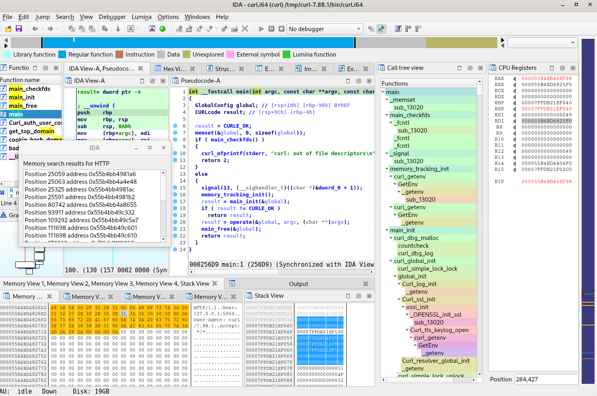

# Frinet

Multi-platform trace generation with Frida, combined with a modified version of the Tenet plugin for exploration.

[Blogpost on the Synacktiv website](https://www.synacktiv.com/publications/frinet-reverse-engineering-made-easier)

**General use case** : Tracing the execution of a specific function in a userland process, on a Frida-compatible system (Tested on Linux/Android/iOS/Windows).

<p align="center">

</p>

This repository contains our customized fork of Tenet in the *tenet* subdirectory. As explained in the
README, we did not do a pull request (yet) because our new features break some of the legacy features.

Our custom version is required for use with this tracer, but can still process traces from other 
Tenet tracers.

## Tracer

### Features

Compatible with **Linux**, **Android** & **iOS**

Fully supported architecture :

 * arm64
 * x64

Partially supported architectures (slower and less precise memory tracking, but usually good enough) :

 * arm
 * x86

### Dependencies

Python3 and Frida

### How to use

```
usage: python3 trace.py [-h] [-v] [-D DEVICE] [-U] [-R] [-H HOST] [-m]
                          [-a ARGS] [-e] [-s] [-E END]
                          {spawn,attach} ... process module addr

positional arguments:
  {spawn,attach}
    spawn               Spawn process
    attach              Attach to process
  process               attach:[process name or PID]; spawn:[binary path or
                        package name]
  module                module name to instrument
  addr                  entrypoint function address

optional arguments:
  -h, --help            show this help message and exit
  -v, --verbose         verbose output
  -D DEVICE, --device DEVICE
                        connect to device with the given ID
  -U, --usb             connect to USB device
  -R, --remote          connect to remote frida server
  -H HOST, --host HOST  connect to remote frida server on host
  -m, --multirun        do not unhook after first execution
  -a ARGS, --args ARGS  comma-separated argument list for spawn (including
                        binary name) : "/bin/sh,-c,ls"
  -e, --exclude         exclude all other modules (memory tracing will be
                        inaccurate)
  -s, --slow            use slower JS implementation (multiarch)
  -E END, --end END     specify end address instead of function exit (-1 to
                        never end)
```

#### Example : Spawn a new process to trace

```
python3 trace.py spawn [BIN_PATH] [MODULE_NAME] [FUNC_ADDR] -a [ARGS]
python3 trace.py spawn /bin/ls ls 0x1234 -a '/bin/ls,-la'
```

This will trace one execution of the function at address 0x1234, until it returns.

It is also possible to specify an end address with "-E", or trace multiple executions with "-m".

#### Example : Attach to a process on Android device

```
python3 trace.py attach [PROCNAME_OR_PID] [MODULE_NAME] [FUNC_ADDR] -U
python3 trace.py attach sh sh 0x1234 -U
```


## Tenet

### Dependencies

IDA Pro (tested on ```Version 8.3.230608 Linux x86_64``` but should work in most recent versions compatible with Tenet legacy)

### How to use

```
cp tenet/plugins/tenet_plugin.py ~/.idapro/plugins
cp -R tenet/plugins/tenet ~/.idapro/plugins
```

Then, in IDA after loading the correct binary :

```
File -> Load file -> Tenet trace file
```

For more information, see the original author's blogpost about the tool :
 * http://blog.ret2.io/2021/04/20/tenet-trace-explorer/

### New features

Some new features have been added to the **Tenet** plugin.
The compressed trace format feature has been removed for now, as it needs to be modified to handle the added features.

Most notably :
 * The **Call tree view** window gives a clickable indented overview of the whole execution trace.
 * The **Seach bytes** feature is available in the **Memory views** context menu, and does the search in both space and time
